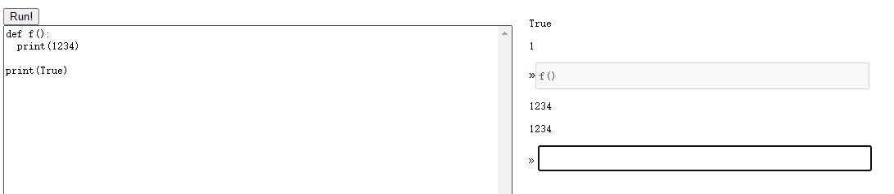
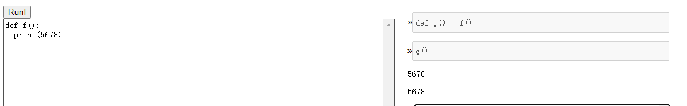
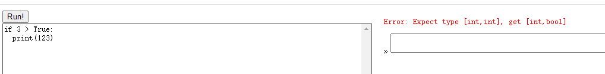
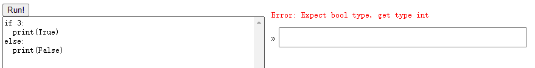
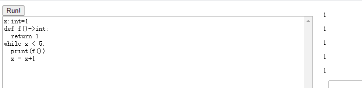
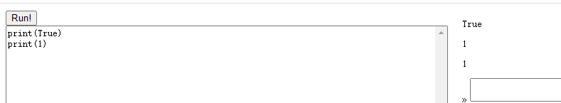
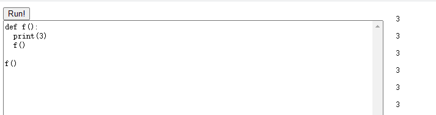
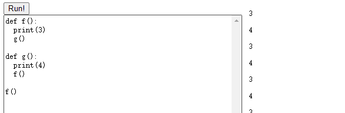

# PA2

## Q1

A description of the representation of values (integers, booleans, and None) in your implementation. Give examples, and explain why it is necessary to do so.

In my program, none has tag 0, bool has tag 1, int has tag 2. I use 4 bytes to store tags and another 4 bytes to store values. It's useful to have tags, for example, if we want to distinguish True and 1, we can check the tags. In my implementation, the built-in print function will take tag as parameters so that it could print values accordingly, for example: "True" for True and "1" for 1.

## Q2

My program use memory as another function call stack. It begins from the highest address. On the lowest address, I have a stack pointer and a dynamic link pointer, I also keep the static link pointer at the next 4 bytes of the dynamic link pointer. So I put all the global variables on the highest address of the memory, and use a stack pointer to maintain the stack. 

Here is an example of my memory:

```
0x00000  0
0x00004  stack pointer
0x00008  dynamic link pointer
...
0x9ffbc  local var 1 <- stack pointer
0x9ffc4  local var 2
0x9ffcc  static link
0x9ffd0  old dynamic link <- dynamic link pointer
0x9ffd4  return value
0x9ffdc  param1
0x9ffe4  param2
0x9ffec  global var 1
0x9fff4  global var 2
0x9fffc  0
0xa0000  0
```

### At least one global variable

```
x:int=2
print(x)
```

We loop through all variables first, then assign the index for each of them. Each global variable will have its own offset to the base.Then I can use the static pointer plus the offset to get these global variables. Noticing that each variable occupy 8 bytes, 4 upper bytes represent the type of this variable.

```typescript
function codeGenVarDef(vds: VarDef[]): Array<string> {
  let wasms: Array<string> = new Array();
  let idx = 0;
  if (curEnv.name === "") {
    idx = curEnv.nameToVar.size - vds.length;
  }
  vds.forEach((vd) => {
    let varVal = curEnv.nameToVar.get(vd.tvar.name);
    varVal.offset = 2 + idx*2;  // offset relative to static pointer
    idx += 1;
    wasms = wasms.concat(
      updateGeneralPointerWithOffset("SP", varVal.type.size),
      setPointerWithOffsetVariable(generalPointer.get("SP"), varVal)
    );
  })

  return wasms;
}
```

```typescript
function codeGenExpr(expr: Expr) : Array<string> {
  let wasms: Array<string> = new Array();

  switch(expr.tag) {
    case "literal": {
      return codeGenLiteral(expr.value);
    }
    case "id": {
      wasms = wasms.concat(getPointerWithOffset(generalPointer.get("DL"), -1));  // pointer to current SL 
      let iterEnv = curEnv;
      let counter = 0;
      while (iterEnv) {
        if (iterEnv.nameToVar.has(expr.name)) {
          break;
        }
        counter += 1;
        iterEnv = iterEnv.parent;
        wasms = wasms.concat([`(i32.load)`])
      }
      // at SL now
      let idInfo = iterEnv.nameToVar.get(expr.name);
      wasms = wasms.concat([
        `(i32.const ${- (idInfo.offset - 1) * 4})`,
        `(i32.add)`,
        `(i32.load)`,
      ])
      break;
    }
...
```


### At least one function with a parameter

By linking to specific definitions and code in your implementation, describe where and how those three variables are stored and represented throughout compilation.

```
def f(x:int)->int
  return x+1
f(2)
```

Return value and parameters are always below where the dynamic link pointer points to and their offset and calculated during parsing as well. The code generator for id is exactly the same as global variables. Below is the code for indexing the parameters.

```typescript
function codeGenExpr(expr: Expr) : Array<string> {
...
    case "call": {
      ...

      wasms = wasms.concat(
        updateGeneralPointerWithOffset("SP", (expr.args.length+1)*2),
      );
      ...

      expr.args.forEach((arg, i) => {
        let varVal = iterEnv.nameToVar.get(iterEnv.paramsName[i]);
        wasms = wasms.concat(
          setPointerWithOffset(generalPointer.get("SP"), (i+1)*2, codeGenTag(varVal.type.tag)),
          setPointerWithOffset(generalPointer.get("SP"), (i+1)*2+1, codeGenExpr(arg))
        );
        varVal.offset = -4-2*i;
      });

      ...

      wasms = wasms.concat(
        addActiRec(loadSL),
        [`call $${funcGlobalName}`],
        removeActiRec(),
        updateGeneralPointerWithOffset("SP", -(expr.args.length+1)*2),
      )
...
```


### At least one variable defined inside a function

```
def f()->int
  x:int=2
  return x+1
f()
```

According to the memory distribution, we can find a local variable using static link and some offsets as well. The code here reuse the code for global variables. 

## Q3

Write a Python program that goes into an infinite loop. What happens when you run it on the web page using your compiler?

```
x:int=2
while x>1:
  print(x)
```

This program keeps running silently, then suddenly renders a lot of number 2 on screen. We can see logs keep accumulating in the console.

## Q4

For each of the following scenarios, show a screenshot of your compiler running the scenario. If your compiler cannot handle the described scenario, write a few sentences about why.

A function defined in the main program and later called from the interactive prompt



A function defined at the interactive prompt, whose body contains a call to a function from the main program, called at a later interactive prompt



A program that has a type error because of a mismatch of booleans and integers on one of the arithmetic operations



A program that has a type error in a conditional position



A program that calls a function from within a loop 



Printing an integer and a boolean




A recursive function.



Two mutually-recursive functions.





